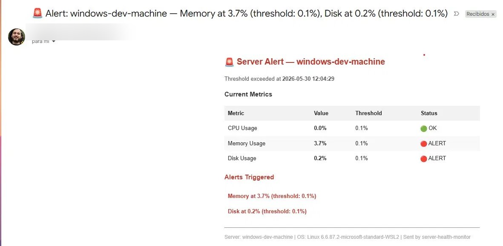

# 🖥️ Server Health Monitor


A Python-based monitoring bot that tracks CPU, memory, and disk usage on Linux servers and sends formatted HTML email alerts when thresholds are exceeded.

Built as part of my SRE/DevOps learning journey — simulating real-world infrastructure monitoring patterns used by tools like Prometheus and Datadog.

---

## 📸 Alert email preview

> Formatted HTML alert showing metric table, thresholds, and triggered alerts — sent automatically via Gmail SMTP.



---

## 🚀 Features

- Real-time CPU, memory, and disk monitoring via `psutil`
- Configurable alert thresholds per metric
- Formatted HTML email alerts with metric table and status indicators
- Secure credential management via `.env` file — nothing sensitive in the codebase
- Runs continuously with a configurable check interval
- Lightweight — no external monitoring infrastructure required

---

## 🛠️ Tech stack

| Tool | Purpose |
|---|---|
| Python 3.12 | Core language |
| psutil | Linux kernel metric collection |
| smtplib | Gmail SMTP email delivery |
| python-dotenv | Secure credentials management |
| WSL / Ubuntu | Linux runtime environment |

---

## ⚙️ How it works

```
Start script
     ↓
Load config + credentials from .env
     ↓
Collect metrics every 60s (psutil → /proc)
     ↓
Compare against thresholds
     ↓
If exceeded → build HTML email → send via Gmail SMTP
     ↓
Sleep → repeat
```

---

## 📦 Installation

### Prerequisites
- Python 3.12+
- Linux or WSL (Ubuntu)
- Gmail account with App Password enabled

### Setup

```bash
# Clone the repo
git clone https://github.com/aaguilarc-cr/server-health-monitor.git
cd server-health-monitor

# Create and activate virtual environment
python3 -m venv venv
source venv/bin/activate

# Install dependencies
python -m pip install -r requirements.txt

# Configure credentials
cp env.example .env
nano .env
```

### Configure `.env`

```env
EMAIL_SENDER=your-gmail@gmail.com
EMAIL_PASSWORD=your-16-char-app-password
EMAIL_RECEIVER=your-gmail@gmail.com
SERVER_NAME=your-server-name
```

> To get a Gmail App Password: Google Account → Security → 2-Step Verification → App Passwords

---

## ▶️ Usage

```bash
source venv/bin/activate
python monitor.py
```

Expected output:
```
🖥️  Server Health Monitor started for: my-linux-server
📊 Thresholds — CPU: 80% | Memory: 80% | Disk: 85%
⏱️  Checking every 60 seconds

[11:09:55] CPU: 12.0% | Memory: 45.3% | Disk: 23.1% — ✅ All OK
[11:10:55] CPU: 87.2% | Memory: 45.3% | Disk: 23.1% — 🚨 1 alert(s) sent
```

---

## 🔧 Configuration

Edit `config.py` to adjust thresholds and check interval:

```python
CPU_THRESHOLD = 80        # Alert if CPU exceeds 80%
MEMORY_THRESHOLD = 80     # Alert if memory exceeds 80%
DISK_THRESHOLD = 85       # Alert if disk exceeds 85%
CHECK_INTERVAL_SECONDS = 60  # Check every 60 seconds
```

---

## 🗺️ Roadmap

- [ ] Add Slack webhook support alongside email
- [ ] Dockerize the application
- [ ] Add GitHub Actions CI pipeline
- [ ] Migrate to Prometheus + Grafana for production-grade monitoring
- [ ] Support monitoring multiple remote servers via SSH

---

## 📚 What I learned

- Linux kernel metric collection via `/proc` filesystem
- Secure secrets management with `.env` and `python-dotenv`
- SMTP authentication with TLS (`starttls`)
- Python virtual environments in WSL
- Git workflow: branching, commits, pushing to GitHub

---

## 👤 Author

**Alessandro Aguilar**
- GitHub: [@aaguilarc-cr](https://github.com/aaguilarc-cr)
- LinkedIn: [alessandroaguilarc](https://www.linkedin.com/in/alessandroaguilarc/)
